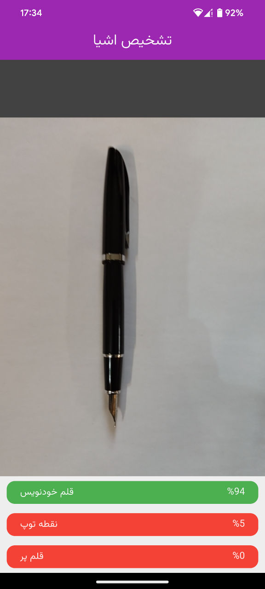
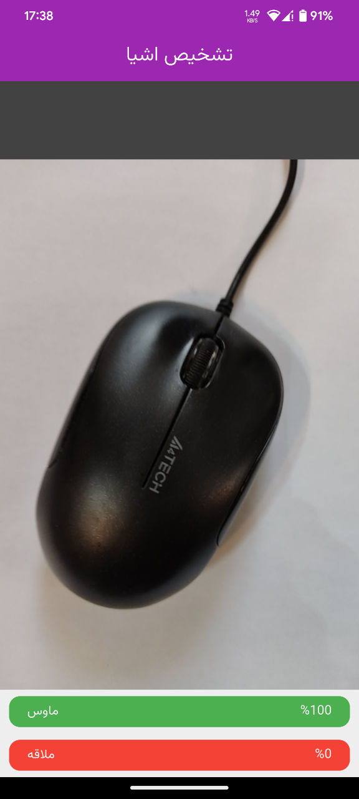

<!-- PROJECT SHIELDS -->
  [](https://github.com/mostafa-efafi/Object_Recognition_ML/actions/workflows/build.yml)
   
   [](https://img.shields.io/github/v/tag/mostafa-efafi/Object_Recognition_ML?label=latest%20version)
<!-- PROJECT LOGO -->
# Object Recognition(ML)

>  This application identifies various objects with a machine learning model from .tflite file using a mobile phone camera.

<p align="left">
    
    
</p>

_Object Recognition_ is a mobile application for recognizing objects using machine learning. This app uses deep learning models to identify objects in phone camera images.

### Features and Components
- Fast detection of objects (15 times per second)
- Translated into Persian
- Identifying objects with their probability percentage
- Written in Dart language and Flutter framework
- Available for Android and iOS

Alternatively, download snapshots from the [continuous integration action](https://github.com/mostafa-efafi/Object_Recognition_ML/actions/workflows/build.yml) (requires a Github account, be aware that Github zips the apk on download, so unzip first).


### Build
This is a flutter based Android application. Ensure to have Android-Studio (or VSCode) and flutter-sdk installed.
```
flutter pub get
flutter build apk
```
 
### Feature and Contribution Ideas
Pull requests are welcome :heart:.

- [ ] A better logo
- [ ] Making a more beautiful user interface
- [ ] More correct learning model update
- [ ] Use gallery to select image

And [more ideas](https://github.com/mostafa-efafi/Object_Recognition_ML/issues).

### License
Apache v2

### About
Built with <3   
by Mostafa Efafi  
https://ir.linkedin.com/in/mostafa-efafi-332b0276?original_referer
